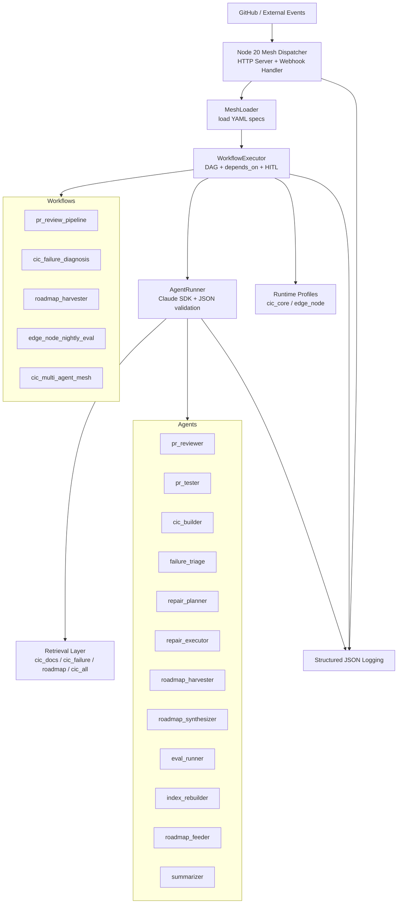

# CIC Mesh Architecture

The autonomous CIC mesh is a deterministic, spec-driven orchestration system for multi-agent engineering workflows. Every workflow, agent, profile, and retrieval config is versionable YAML. The Node 20 dispatcher loads specs on demand and enforces bounded execution.

## Architecture (ASCII)

```
                           +-----------------------------+
                           |        GitHub / Events      |
                           +-----------------------------+
                                      |
                                      v
                         +-----------------------------+
                         |   Node 20 Mesh Dispatcher   |
                         |  (HTTP Server + Webhooks)   |
                         +-----------------------------+
                                      |
             +------------------------+------------------------+
             |                                                 |
             v                                                 v
+---------------------------+                     +---------------------------+
|       MeshLoader          |                     |    Structured Logging     |
|  - Load agents/           |                     |  - JSON events            |
|    workflows/profiles/    |                     |  - Traces per step        |
|    retrieval YAML         |                     +---------------------------+
+---------------------------+
             |
             v
+---------------------------+
|     WorkflowExecutor      |
|  - DAG (Kahn)             |
|  - depends_on ordering    |
|  - HITL gates             |
+---------------------------+
             |
             v
+---------------------------+
|       AgentRunner         |
|  - Claude calls           |
|  - JSON validation        |
+---------------------------+
             |
   +---------+---------+
   |                   |
   v                   v
+-------------------+  +-------------------+
|  Retrieval Layer  |  | Runtime Profiles  |
|  - cic_docs       |  | - cic_core       |
|  - cic_failure    |  | - edge_node      |
|  - roadmap        |  +-------------------+
|  - cic_all        |
+-------------------+
```

## Architecture (Mermaid)



## Workflows (5 total)

| Workflow | Trigger | Runtime | Agents | HITL |
|---|---|---|---|---|
| **pr_review_pipeline** | `pull_request.opened` | cic_core | reviewer, tester, cic_builder, harvester, synthesizer, summarizer | roadmap version bump |
| **cic_failure_diagnosis** | `cic.build.failed` | cic_core | triage, repair_planner, executor, summarizer | medium/high-risk repairs |
| **roadmap_harvester** | `idea.submitted` | cic_core | harvester, synthesizer, summarizer | roadmap version bump |
| **edge_node_nightly_eval** | `0 3 * * *` | edge_node | eval_runner, index_rebuilder, roadmap_feeder, summarizer | none (fully automated) |
| **cic_multi_agent_mesh** | composite | both | all 12 agents | repair + every roadmap bump |

## Agents (12 total)

| Agent | Model | Role |
|---|---|---|
| pr_reviewer | Opus | Deep code review, standards enforcement |
| pr_tester | Haiku | Test execution, failure analysis |
| cic_builder | Haiku | CIC build trigger, basic self-healing |
| failure_triage | Opus | Failure classification, incident correlation |
| repair_planner | Opus | Risk assessment, repair sequencing |
| repair_executor | Haiku | Safe low-risk action execution |
| roadmap_harvester | Opus | Raw idea → scored canonical items |
| roadmap_synthesizer | Opus | Delta merge, version management |
| eval_runner | Haiku | Nightly evals, regression detection |
| index_rebuilder | Haiku | BM25 + vector + RRF rebuild |
| roadmap_feeder | Opus | Eval results → roadmap ideas |
| summarizer | Haiku | Operator-facing summaries |

## Runtime Profiles (2 total)

| Profile | Target | Use |
|---|---|---|
| **cic_core** | cic-cluster | Event-driven, latency-sensitive workflows (PR, failures, ideas) |
| **edge_node** | edge-mac | Long-running nightly evals; index rebuilds; sandboxed from cluster |

## Retrieval Configurations (4 total)

| Config | Indexes | Scope |
|---|---|---|
| **cic_docs** | cic_docs_bm25 + cic_vectors | PR review and general CIC knowledge |
| **cic_failure** | cic_failure_bm25 + cic_failure_vectors | Failure triage (logs, errors, runbooks, DLQ) |
| **roadmap** | roadmap_bm25 + roadmap_vectors | Idea scoring across all CIC domains |
| **cic_all** | cic_bm25 + cic_vectors | Comprehensive; used by mesh and nightly eval |

All use RRF (Reciprocal Rank Fusion) for hybrid search.

## Execution Model

### DAG-based Step Ordering

- Steps with empty `depends_on` run in parallel (e.g., review, tests, cic_build on PR open)
- Kahn's algorithm ensures deterministic, cycle-free ordering
- Steps cannot run until all dependencies complete
- Execution order is reproducible from the same spec

### Template Resolution

All inputs are resolved against a context object:
- `${{ event.pr.diff }}` → pull request diff
- `${{ steps.review.output }}` → previous step's output
- `${{ now }}` → current timestamp

Supports nested objects; preserves structure for agent inputs.

### HITL Gates

- Evaluated after all workflow steps complete
- Condition-guarded (e.g., `${{ steps.plan_repair.output.requires_hitl == true }}`)
- Block approval workflows; return `awaiting_approval` status
- No mutation without explicit approval

## Closed-Loop Reliability

The mesh implements three feedback loops:

**1. Build Loop**
- PR → review/tests/build → success/failure
- Failures feed into both failure diagnosis and roadmap harvesting
- Successful PRs contribute code + roadmap deltas

**2. Failure Loop**
- Failure event → diagnosis → repair plan → low-risk execution
- Medium/high-risk repairs pause at HITL gate
- Diagnosis + repair results feed roadmap

**3. Retrieval Loop**
- Edge node nightly eval → BM25 + vector rebuild
- Eval regressions become roadmap ideas
- Fresh indexes → better future decisions

Each loop is a feedback controller that reduces future failure probability.

## Specs Are Living Artifacts

Every component is versionable YAML in the repo:

```
agents/              # 12 agent definitions + index
profiles/            # 2 runtime profiles + index
retrieval/           # 4 retrieval configs + index
workflows/           # 5 workflows + index
services/mesh-runtime/  # Node 20 dispatcher
```

- Add an agent: one file + one line in `agents/index.yaml`
- Swap a profile: no code changes
- Adjust retrieval scope: edit `retrieval/cic_failure.yaml`
- Update a workflow: edit the YAML file directly

No compilation, no deployment configs, no hidden state. Git history = full audit trail.

## Observability

All events logged as newline-delimited JSON:

```json
{"ts":"2026-06-17T01:30:00Z","level":"info","event":"workflow_start","workflow_id":"pr_review_pipeline"}
{"ts":"2026-06-17T01:30:01Z","level":"info","event":"step_start","workflow_id":"pr_review_pipeline","step_id":"review"}
{"ts":"2026-06-17T01:30:15Z","level":"info","event":"step_success","workflow_id":"pr_review_pipeline","step_id":"review"}
{"ts":"2026-06-17T01:30:30Z","level":"info","event":"hitl_gate_active","workflow_id":"pr_review_pipeline","step":"synthesize_roadmap_from_pr"}
```

Piped to any observability platform (DataDog, Honeycomb, CloudWatch, etc.) for traces, metrics, and alerts.

## What This Enables

1. **Never lose an idea** — Roadmap Harvester captures from failures, PRs, evaluations, operator notes
2. **Self-healing CIC** — Failures auto-diagnose; low-risk fixes execute; humans approve high-risk actions
3. **Living retrieval** — Edge node rebuilds indexes nightly; vectors + BM25 stay sharp
4. **Operator-grade observability** — Structured JSON logs from every step
5. **Deterministic ordering** — DAG-based; no hidden dependencies
6. **Independent versioning** — Add an agent without touching workflows; swap a profile without redeployment
7. **Testable specs** — All YAML; no proprietary DSL; loads from filesystem
8. **Bounded risk** — HITL gates, scoped repairs, explicit risk levels
