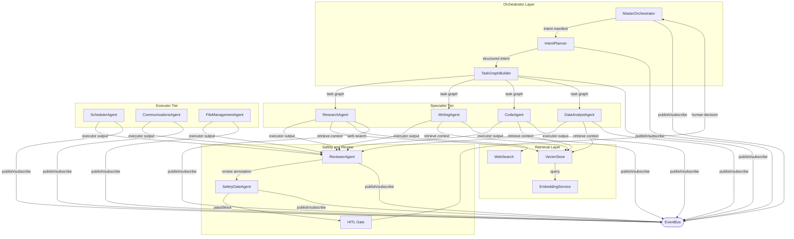

# CIC Mesh v1.0
## Architecture, Reliability, and Deployment of a Cooperative Intelligence Cluster

| Field | Value |
|---|---|
| Document Version | 1.0.0 |
| Status | Publication Ready |
| Date | June 2026 |
| Classification | Internal Technical Reference |
| Audience | Platform Engineers, AI/ML Architects, Senior Engineering Leads |
| Owner | CIC Mesh Platform Team |

---

## Version History

| Version | Date | Author | Change Summary |
|---|---|---|---|
| 0.1 | Jan 2026 | Platform Team | Initial draft. Core mesh topology defined. Orchestrator and agent node concepts introduced. |
| 0.2 | Feb 2026 | Platform Team | Agent catalog added (12 agents). Retrieval configuration schemas defined. |
| 0.3 | Mar 2026 | Platform Team | Runtime profiles introduced. Reliability model drafted. HITL framework v0.1 incorporated. |
| 0.4 | Apr 2026 | Platform Team | Full workflow descriptions added. Mermaid diagrams and ASCII topology maps included. |
| 0.5 | May 2026 | Platform Team | Security and compliance section added. STRIDE analysis completed. K8s topology documented. |
| 1.0 | Jun 2026 | Platform Team | Full publication pass. All appendices added. Glossary extended to 30+ terms. |

---

## Executive Summary

CIC Mesh v1.0 is a production-grade cooperative multi-agent AI orchestration platform designed for enterprise deployment at scale. It replaces monolithic, single-model inference patterns with a structured mesh of specialized agent nodes, each precisely scoped to a functional domain, coordinated by a central orchestrator, and connected through a shared event bus and retrieval backbone.

The three architectural innovations at the core of CIC Mesh are:

1. **Cooperative Multi-Agent Orchestration** — a MasterOrchestrator decomposes intent into task graphs and assigns work to specialist agents running in parallel when dependency constraints permit.
2. **Retrieval-Augmented Generation (RAG) Backbone** — a pluggable retrieval layer supporting multiple vector stores, hybrid search strategies, and freshness-aware context assembly.
3. **Human-in-the-Loop (HITL) Safety Gates** — a tiered approval framework that enforces explicit human confirmation before any irreversible, high-impact, or externally-visible action is taken.

CIC Mesh targets: **99.5% availability**, **97% workflow success rate**, and **sub-500ms retrieval P95 latency** under normal operating conditions.

---

## Table of Contents

1. [Introduction](#1-introduction)
2. [System Architecture](#2-system-architecture)
3. [Agent Catalog](#3-agent-catalog)
4. [Workflow Descriptions](#4-workflow-descriptions)
5. [Retrieval Configuration Reference](#5-retrieval-configuration-reference)
6. [Runtime Profiles](#6-runtime-profiles)
7. [Human-in-the-Loop (HITL) Framework](#7-human-in-the-loop-hitl-framework)
8. [Reliability Model](#8-reliability-model)
9. [Observability and Monitoring](#9-observability-and-monitoring)
10. [Security and Compliance](#10-security-and-compliance)
11. [Deployment Architecture](#11-deployment-architecture)

---

## 1. Introduction

### 1.1 Background and Motivation

Enterprise AI adoption has passed through two recognizable phases. Phase 1 integrated LLMs as point solutions — stateless, single-pass invocations with no memory, no coordination, no validation. Phase 2 introduced chaining: pipeline architectures that improved capability but propagated errors and offered no principled human oversight.

CIC Mesh represents a third architectural pattern: **the cooperative mesh**. Rather than a hub-and-spoke or pipeline model, the mesh is a dynamic directed acyclic graph (DAG) of specialized agents. Each agent is an independent reasoning unit with its own role, context, tools, and confidence model. Agents communicate through a shared event bus, query a shared retrieval backbone, and operate under orchestrator-enforced task graphs constructed dynamically at runtime.

### 1.2 Scope and Goals

**In scope:** mesh topology, agent node specification, orchestrator and planner subsystems, executor and reviewer tiers, RAG retrieval backbone, event bus architecture, external tool integration, all twelve canonical agents, five runtime profiles, HITL framework, reliability model, observability, security, and Kubernetes deployment.

**Explicitly excluded:** model training and fine-tuning, LLM provider selection, end-user UI/UX, billing and cost attribution, multi-tenant isolation (deferred to v1.1).

**Three core design pillars:**
- **Reliability** — graceful degradation under partial failure; never lose workflow state.
- **Observability** — every agent invocation, retrieval call, tool execution, HITL interaction, and workflow state transition is logged, traced, and metered.
- **Operator Control** — humans can override any automated decision, configure thresholds per-agent, and enforce explicit approval gates on any action class.

### 1.3 Terminology

| Term | Definition |
|---|---|
| CIC | Cooperative Intelligence Cluster |
| Mesh | The DAG topology of interconnected AI agent nodes |
| Agent Node | A discrete, role-scoped reasoning unit within the mesh |
| Orchestrator | Top-level agent responsible for workflow lifecycle |
| HITL | Human-in-the-Loop — tiered approval gates |
| RAG | Retrieval-Augmented Generation |
| Runtime Profile | Named configuration bundle governing model tier, token budgets, retrieval depth, HITL gates |
| Workflow | Complete execution instance from intent receipt to archival |
| Task Graph | DAG of discrete tasks with dependency edges |
| Confidence Threshold | Per-agent numeric floor (0.0–1.0) for autonomous output release |
| Fallback Chain | Ordered sequence of alternative execution strategies |
| Safety Gate | Hard checkpoint enforced by SafetyGateAgent |
| Planner Agent | Constructs task graphs from decomposed intent |
| Executor Agent | Worker-tier agent executing specific tasks |
| Reviewer Agent | Post-execution quality-gate agent |
| Token Budget | Maximum tokens (input + output) per agent invocation |
| Event Bus | Publish/subscribe messaging backbone |
| DAG | Directed Acyclic Graph |

---

## 2. System Architecture

### 2.1 Mesh Topology Overview

CIC Mesh is a directed acyclic graph of cooperative AI agent nodes connected by a shared event bus, a unified retrieval backbone, and external tool connectors. The topology is layered:

```
┌─────────────────────────────────────────────────────────────────────────────┐
│                         ORCHESTRATOR LAYER                                  │
│   MasterOrchestrator ──▶ IntentPlanner ──▶ TaskGraphBuilder                 │
└──────────────────────────────────────────────────────────────────────────────┘
                    │                                    │
┌─────────────────────────────────────────────────────────────────────────────┐
│                       PLANNER / SPECIALIST TIER                             │
│   ResearchAgent  │  WritingAgent  │  CodeAgent  │  DataAnalystAgent         │
└──────────────────────────────────────────────────────────────────────────────┘
                    │                                    │
┌─────────────────────────────────────────────────────────────────────────────┐
│                           EXECUTOR TIER                                     │
│   SchedulerAgent  │  CommunicationsAgent  │  FileManagementAgent            │
└──────────────────────────────────────────────────────────────────────────────┘
                    │                                    │
┌─────────────────────────────────────────────────────────────────────────────┐
│                       SAFETY AND REVIEW TIER                                │
│       ReviewerAgent ──▶ SafetyGateAgent ──▶ HITL Gate ◀── Human Input      │
└──────────────────────────────────────────────────────────────────────────────┘

══════════════════════ EVENT BUS (Redis Streams / Kafka) ═════════════════════

┌─────────────────────────────────────────────────────────────────────────────┐
│                       RETRIEVAL LAYER (RAG)                                 │
│   VectorStore  │  EmbeddingService  │  WebSearch Index                      │
└──────────────────────────────────────────────────────────────────────────────┘

┌─────────────────────────────────────────────────────────────────────────────┐
│                 EXTERNAL TOOL INTEGRATION LAYER                             │
│   Email │ Calendar │ Files │ Browser │ APIs/Webhooks                        │
└──────────────────────────────────────────────────────────────────────────────┘
```

### 2.2 Agent Node Architecture

Every agent in CIC Mesh is instantiated from a common agent node specification with the following components:

- **Role Definition** — terse machine-readable role identifier (e.g., `executor/communications`)
- **System Prompt Template** — structured prompt with variable injection for workflow context
- **Retrieval Config Pointer** — reference to a named retrieval configuration (null if agent does not use retrieval)
- **Tool Manifest** — explicit, versioned declaration of all tools this agent may invoke; orchestrator rejects undeclared invocations
- **Token Budget** — maximum combined input/output token count, enforced by the orchestrator
- **Confidence Threshold** — numeric floor (0.0–1.0); scores below threshold escalate to Reviewer or HITL
- **Escalation Policy** — structured rule set defining actions at each failure or confidence condition
- **Fallback Chain** — ordered list of alternative execution strategies

### 2.3 Orchestrator Design

The MasterOrchestrator executes the following planning loop:

1. **Intent Reception** — Accept structured or natural-language intent; attach `workflow_id`, `user_id`, timestamp, runtime profile.
2. **Intent Decomposition** — Pass to IntentPlanner → structured intent manifest with goal, sub-objectives, format requirements, constraint flags.
3. **Task Graph Construction** — TaskGraphBuilder generates a DAG of discrete tasks with dependency edges and parallelism opportunities.
4. **Agent Assignment** — For each task node, select appropriate agent based on task type, required tools, and agent availability.
5. **Execution Monitoring** — Subscribe to result and status events; enforce timeout policies; trigger fallback chains on failure.
6. **Result Aggregation** — Accumulate partial results; merge parallel branch outputs at fan-in joins.
7. **Output Synthesis** — Compose final output from aggregated results; route through ReviewerAgent if required by runtime profile.

### 2.4 Planner Agent Subsystem

The **IntentPlanner** receives raw user intent and produces a structured intent manifest, classifying task complexity as LOW, MEDIUM, or HIGH. The **TaskGraphBuilder** constructs an explicit task DAG with conservative dependency resolution: tasks are sequenced unless the planner can prove parallel execution is correct. The completed graph is published to the event bus as a `task_graph.created` event.

### 2.5 Executor Agent Subsystem

Executor agents (SchedulerAgent, CommunicationsAgent, FileManagementAgent) receive task assignments via the event bus, execute domain-specific work, perform mid-task RAG queries, and return structured result objects. Each manages its own context window with priority-scored context trimming when retrieval would exceed budget. Results include confidence scores; scores below threshold are flagged `requires_review`.

### 2.6 Reviewer / Validator Agent Subsystem

The ReviewerAgent applies four evaluation dimensions to task results:

1. **Factual Consistency** — Cross-references claims against retrieval sources; flags unsupported assertions.
2. **Format Compliance** — Validates output against format specification from the intent manifest.
3. **Safety Screening** — Applies content policy rules; escalates violations to SafetyGateAgent.
4. **Confidence Aggregation** — Produces a composite review confidence score; approves or escalates.

Review annotations are written directly into the result envelope as a structured JSON object.

### 2.7 Retrieval Layer (RAG Backbone)

The retrieval layer provides on-demand knowledge retrieval to any agent. It is provider-agnostic, supporting Azure AI Search, Pinecone, Weaviate, and pgvector. Retrieved chunks are assembled into a context block ordered by relevance score, filtered by freshness, injected at a designated insertion point in the system prompt template. Chunks are dropped from the bottom of the ranked list when the token budget is exceeded.

### 2.8 Event Bus Architecture

The event bus is the central nervous system of CIC Mesh. Backend: Redis Streams (default) or Apache Kafka (high-throughput). Topic naming: `{mesh_id}.{workflow_id}.{agent_id}.{event_type}`. The message envelope includes schema version, event type, source agent ID, workflow ID, ISO 8601 timestamp, payload, correlation ID, and retry counter. Dead-letter queues capture messages exceeding max delivery retries (default: 3).

### 2.9 External Tool Integration Layer

All connectors implement a common interface: `invoke(tool_name, params) → {status, result, latency_ms, error_code}`. Connectors handle OAuth 2.0 token refresh, API key rotation from vault, rate limiting (token bucket), exponential backoff with jitter (max 3 retries), and circuit breaker state management.

| Connector | Protocol | Rate Limit | Circuit Breaker Trip | Auth |
|---|---|---|---|---|
| Email (Gmail/Outlook) | REST/Graph API | 10 req/min | 5 failures/60s | OAuth 2.0 |
| Calendar (GCal/Outlook) | REST/Graph API | 10 req/min | 5 failures/60s | OAuth 2.0 |
| OneDrive/Google Drive | REST/Graph API | 20 req/min | 5 failures/60s | OAuth 2.0 |
| Web Search | REST | 30 req/min | 10 failures/60s | API Key (vault) |
| Browser Automation | WebDriver/CDP | 5 req/min | 3 failures/60s | Session token |
| Image Generation | REST | 5 req/min | 3 failures/60s | API Key (vault) |
| TTS/Voice | REST | 10 req/min | 5 failures/60s | API Key (vault) |
| Webhooks/External APIs | REST/gRPC | Configurable | Configurable | Configurable |

---

## 3. Agent Catalog

| Agent | Role | Layer | Tools | Retrieval Config | Confidence Threshold | Escalation Policy |
|---|---|---|---|---|---|---|
| MasterOrchestrator | orchestrator/master | Orchestrator | EventBus, AgentRegistry, WorkflowStore | None | N/A | Operator alert on unresolvable failure |
| IntentPlanner | planner/intent | Orchestrator | None | KnowledgeBase-General | 0.80 | Retry (1x), then HITL clarification |
| TaskGraphBuilder | planner/graph | Orchestrator | None | None | 0.85 | Retry (2x), then operator alert |
| ResearchAgent | specialist/research | Specialist | WebSearch, Browser | WebSearch-Realtime, KnowledgeBase-Technical | 0.75 | Retry, fallback to KB only, then Reviewer |
| WritingAgent | specialist/writing | Specialist | FileManagement | UserDocuments, KnowledgeBase-General | 0.78 | Retry, then Reviewer escalation |
| CodeAgent | specialist/code | Specialist | CodeExecutor, FileManagement, WebSearch | KnowledgeBase-Technical | 0.80 | Retry (2x), then Reviewer, then HITL |
| DataAnalystAgent | specialist/data | Specialist | CodeExecutor, FileManagement, SpreadsheetConnector | UserDocuments | 0.80 | Retry, then Reviewer escalation |
| SchedulerAgent | executor/scheduler | Executor | Calendar, TaskStore, NotificationService | UserCalendar-Temporal | 0.85 | HITL for all create/delete actions |
| CommunicationsAgent | executor/communications | Executor | Email, Calendar, NotificationService | UserEmail-Semantic | 0.85 | SafetyGate → HITL for all sends |
| FileManagementAgent | executor/filemanagement | Executor | OneDrive, GoogleDrive, LocalFileSystem | UserDocuments | 0.82 | HITL for delete/overwrite operations |
| ReviewerAgent | reviewer/quality | Review | None | KnowledgeBase-General, KnowledgeBase-Technical | 0.80 | Re-execution request (1x), then HITL |
| SafetyGateAgent | reviewer/safety | Review | ContentFilterAPI | None | 1.0 (binary pass/fail) | Hard block + HITL on any failure |

### Agent Narrative Descriptions

**MasterOrchestrator** — Apex coordination node. Manages the full execution lifecycle from planning through archival. Does not perform domain reasoning; its intelligence is organizational.

**IntentPlanner** — Transforms raw user input into a structured intent manifest. Classifies goal types, identifies required capabilities, detects constraint flags. When intent is ambiguous, generates a clarification request via HITL.

**TaskGraphBuilder** — Constructs execution DAG from the intent manifest. Models task dependencies, parallelism opportunities, and fan-in join conditions. Invalid or cyclic graphs are rejected at construction time.

**ResearchAgent** — Primary knowledge-gathering unit. Combines real-time web search with retrieval from indexed knowledge bases. Performs multi-hop research; attaches source provenance metadata.

**WritingAgent** — Specializes in structured document generation. Consumes research briefs; applies format specifications from the intent manifest. Maintains style context across long documents.

**CodeAgent** — Handles code generation, analysis, debugging, and execution. Sandboxed code execution validates correctness before external use. Applies strict confidence threshold given side effects of executed code.

**DataAnalystAgent** — Processes structured data using code execution. Returns computed results with the formula or code used to produce them for auditability.

**SchedulerAgent** — Manages time-based operations. Every create/delete on a calendar resource triggers HITL. Maintains temporal context with timezone, availability signals, and conflict detection.

**CommunicationsAgent** — Handles outbound communications. Every send operation routes through SafetyGateAgent then mandatory HITL before delivery. Retrieves prior email context for compositional continuity.

**FileManagementAgent** — Handles file system operations across storage providers. Destructive operations require HITL. Maintains operation log for audit trail and rollback reference.

**ReviewerAgent** — Quality assurance gate. Applies factual consistency, format compliance, safety pre-screening, and confidence aggregation. Can request one re-execution pass from the originating agent.

**SafetyGateAgent** — Final defense layer. Binary PASS or BLOCK. Any BLOCK triggers immediate HITL escalation with structured safety report. No confidence threshold below 1.0.

---

## 4. Workflow Descriptions

### 4.1 Workflow Lifecycle

```
TRIGGER → PENDING → PLANNING → EXECUTING → REVIEWING → COMPLETE
                                    │             │
                              AWAITING_HITL ◀────┘
                                    │
                                  FAILED → ROLLED_BACK
```

| State | Valid Transitions | Trigger Condition | Action on Entry |
|---|---|---|---|
| PENDING | PLANNING, FAILED | Workflow created; resources reserved | Assign workflow_id, select runtime profile |
| PLANNING | EXECUTING, AWAITING_HITL, FAILED | IntentPlanner + TaskGraphBuilder invoked | Emit task_graph.created; assign agents |
| EXECUTING | AWAITING_HITL, REVIEWING, FAILED | Task graph agents are running | Monitor agent result events; enforce timeouts |
| AWAITING_HITL | EXECUTING, REVIEWING, FAILED, ROLLED_BACK | HITL gate opened; awaiting human decision | Suspend downstream execution; notify user; start timeout timer |
| REVIEWING | COMPLETE, AWAITING_HITL, EXECUTING, FAILED | Reviewer and/or SafetyGate active | Route output to ReviewerAgent; aggregate review scores |
| COMPLETE | (terminal) | All tasks complete; review passed | Archive workflow record; seal audit trail |
| FAILED | ROLLED_BACK, (terminal) | Unrecoverable error; fallback chain exhausted | Log failure; notify operator; evaluate rollback |
| ROLLED_BACK | (terminal) | Rollback policy applied | Execute compensating actions; archive rollback record |

### 4.2 Standard Workflow: Research and Report

**Trigger:** "Research the current state of enterprise AI orchestration platforms and produce a 5-page executive report." (BALANCED profile)

**Planning:** IntentPlanner classifies complexity=HIGH, output=structured-document. TaskGraphBuilder creates: `[ResearchAgent-Web] ∥ [ResearchAgent-KB] → [WritingAgent] → [ReviewerAgent] → [SafetyGateAgent] → [Output]`

**Executing (Parallel):** ResearchAgent spawns two parallel subtasks: web search (top-k=10) and knowledge base retrieval (KnowledgeBase-Technical, top-k=8).

**Executing (Join):** Orchestrator merges research briefs → WritingAgent produces 5-section draft. Confidence: 0.84.

**Reviewing:** ReviewerAgent flags 2 claims as weakly sourced. Composite confidence: 0.81. Status: APPROVED with annotations.

**Safety Gate:** PASS.

**Complete:** Final report archived with full trace, retrieval sources, and review annotations.

### 4.3 Standard Workflow: Email Compose and Send

**Trigger:** "Send a follow-up email to the team about Friday's meeting postponement."

**Planning:** complexity=LOW, requires_hitl=true. Graph: `[CommunicationsAgent] → [ReviewerAgent] → [SafetyGateAgent] → [HITL-CONFIRM] → [Send]`

**Key steps:** CommunicationsAgent retrieves prior email thread context. Reviewer checks tone, factual consistency, safety. SafetyGateAgent scans for PII and unintended recipients. HITL Confirmational gate presents draft to user. User approves. Email sends via connector.

### 4.4 Standard Workflow: Scheduled Recurring Task

**Trigger:** "Every Monday morning at 8 AM, pull last week's project updates and email me a summary."

**Profile:** SCHEDULED. SchedulerAgent registers recurrence with HITL confirmation. Each Monday execution: ResearchAgent → WritingAgent → CommunicationsAgent → SafetyGateAgent → HITL-SEND-CONFIRM.

### 4.5 Standard Workflow: Multi-Step Document Creation

**Trigger:** "Create a comprehensive technical whitepaper on CIC Mesh architecture." (THOROUGH profile)

**Planning:** Parallel-heavy graph: `[ResearchAgent-Web ∥ ResearchAgent-KB ∥ DataAnalystAgent] → [WritingAgent-Draft] ∥ [ReviewerAgent-Outline-Check] → [WritingAgent-Revise] → [ReviewerAgent-Final] → [SafetyGateAgent] → [Output]`

Token budget: 8,000 output tokens. Two reviewer passes (outline + final). Final composite confidence: 0.87.

---

## 5. Retrieval Configuration Reference

### 5.1 Retrieval Config Schema

```json
{
  "$schema": "https://cicmesh.internal/schemas/retrieval-config/v1.0.json",
  "properties": {
    "index_name": { "type": "string" },
    "namespace": { "type": "string", "default": "default" },
    "embedding_model": { "type": "string", "examples": ["text-embedding-3-large"] },
    "top_k": { "type": "integer", "minimum": 1, "maximum": 50, "default": 5 },
    "score_threshold": { "type": "number", "minimum": 0.0, "maximum": 1.0, "default": 0.75 },
    "hybrid_search": { "type": "boolean", "default": false },
    "rerank": { "type": "boolean", "default": false },
    "freshness_days": { "type": "integer", "default": 365 },
    "max_tokens_retrieved": { "type": "integer", "default": 2048 },
    "chunking_strategy": { "type": "string", "enum": ["fixed-size", "sentence-boundary", "semantic"] }
  }
}
```

### 5.2 Standard Retrieval Profiles

| Profile | Index | Embedding Model | top_k | Score Threshold | Hybrid | Rerank | Freshness | Max Tokens |
|---|---|---|---|---|---|---|---|---|
| KnowledgeBase-General | cic-kb-general | text-embedding-3-large | 5 | 0.75 | false | false | 365d | 2048 |
| KnowledgeBase-Technical | cic-kb-technical | text-embedding-3-large | 8 | 0.78 | true | true | 180d | 3072 |
| UserDocuments | cic-user-docs | text-embedding-3-large | 6 | 0.72 | true | false | 730d | 2048 |
| WebSearch-Realtime | web-search-live | text-embedding-ada-002 | 10 | 0.65 | false | true | 7d | 4096 |
| UserEmail-Semantic | cic-user-email | text-embedding-3-large | 5 | 0.70 | true | false | 90d | 1536 |
| UserCalendar-Temporal | cic-user-calendar | text-embedding-ada-002 | 5 | 0.68 | false | false | 30d | 1024 |

### 5.3 Retrieval Quality Metrics

| Metric | Definition | Target | Tuning Action |
|---|---|---|---|
| Precision@k | Fraction of top-k chunks that are genuinely relevant | ≥ 0.70 | Raise score_threshold; enable reranking |
| Recall@k | Fraction of all relevant chunks appearing in top-k | ≥ 0.60 | Increase top_k; enable hybrid search |
| MRR | Average reciprocal rank of first relevant chunk | ≥ 0.65 | Enable reranking; switch chunking strategy |
| NDCG@k | Quality of ranked list weighted by relevance and position | ≥ 0.72 | Tune score_threshold; update embedding model |

When any metric falls below threshold for three consecutive daily measurement windows, the config is flagged for operator review.

---

## 6. Runtime Profiles

### 6.1 What is a Runtime Profile?

A runtime profile is a named, immutable configuration bundle governing all behavioral parameters for an agent execution context. Profiles are declared as versioned YAML objects, registered in the profile registry, and referenced by name at workflow instantiation time. Agents cannot override their active profile.

### 6.2 Standard Runtime Profiles

**FAST Profile** — Model Tier: Small | Token Budget: 2K/1K | HITL: Confirmational only for sends | Reviewer: Skipped | Confidence Threshold: +0.05 | Latency Target: <3s P95

**BALANCED Profile** — Model Tier: Standard | Token Budget: 6K/2K | HITL: Confirmational for external actions; Blocking for safety failures | Reviewer: Single pass | Latency Target: <10s P95

**THOROUGH Profile** — Model Tier: Large | Token Budget: 16K/8K | HITL: Full gate activation | Reviewer: Two passes (outline + final) | Confidence Threshold: -0.05 | Latency Target: <60s P95

**SCHEDULED Profile** — Model Tier: Standard | Token Budget: 8K/4K | HITL: Confirmational for sends | Reviewer: Single pass | Latency Target: None (background)

**SAFE Profile** — Model Tier: Standard (temperature 0.2) | Token Budget: 6K/2K | HITL: ALL gates active | Reviewer: Mandatory two-pass; SafetyGateAgent double-invoked | Confidence Threshold: +0.10 | Latency Target: <30s P95

### 6.3 Profile Selection Logic

1. **Operator Override** — Explicitly assigned profile takes precedence unconditionally.
2. **Task Complexity Score** — LOW → FAST, MEDIUM → BALANCED, HIGH → THOROUGH.
3. **Constraint Flags** — `sensitive_data=true` or `external_send=true` elevates profile tier.
4. **Scheduled Trigger** — SchedulerAgent-triggered workflows receive SCHEDULED profile unless overridden.
5. **Prior Workflow History** — Workflows with recent HITL escalations or safety failures in 30-day window are elevated one tier.

---

## 7. Human-in-the-Loop (HITL) Framework

### 7.1 HITL Philosophy

The HITL framework is built on accountability as an architectural guarantee, not an afterthought. Three tiers:

- **Informational (Tier 1)** — System notifies operator; no approval required; action proceeds; logged.
- **Confirmational (Tier 2)** — System presents proposed action; requires explicit approval before proceeding. Decision logged with timestamp.
- **Blocking (Tier 3)** — System halts all downstream execution; cannot proceed until human with appropriate permissions resolves. No timeout bypass.

### 7.2 HITL Gate Triggers

| Trigger Condition | HITL Tier | Suspending Agent | Resolution Path |
|---|---|---|---|
| Sending any email or message | Confirmational | CommunicationsAgent | User approves/rejects/edits draft |
| Creating a calendar event | Confirmational | SchedulerAgent | User confirms event details |
| File deletion or overwrite | Confirmational | FileManagementAgent | User confirms with file name display |
| External API call with side effects | Confirmational | Any Executor | User approves API action and parameters |
| Bulk operations (>10 items) | Confirmational | Any Executor | User confirms scope |
| Any financial transaction | Confirmational | Any Executor | User confirms amount and recipient |
| Irreversible destructive action | Blocking | SafetyGateAgent | Operator review and explicit release |
| PII transmission to external parties | Blocking | SafetyGateAgent | Compliance officer review required |
| SafetyGateAgent BLOCK result | Blocking | SafetyGateAgent | Safety review team resolution |
| Agent confidence below 0.60 | Blocking | ReviewerAgent | Human review of agent output |
| Task graph construction failure | Blocking | TaskGraphBuilder | Operator clarifies intent |
| Intent ambiguity | Informational → Confirmational | IntentPlanner | User disambiguates intent |

### 7.3 HITL Timeout and Escalation

Confirmational gates: configurable timeout (default: 24 hours). Blocking gates: no timeout.

- **T+0** — Gate opens. User notified via primary channel. Workflow suspended.
- **T+6h** — First reminder.
- **T+12h** — Second reminder. Operator also notified.
- **T+24h** — Gate timeout. Workflow transitions to AWAITING_HITL → FAILED (or `auto-reject`/`suspend` per policy).

### 7.4 HITL Audit Trail

Every HITL interaction is written to the immutable audit log:

```json
{
  "audit_event_type": "hitl_gate_interaction",
  "timestamp": "2026-06-16T21:12:00Z",
  "workflow_id": "wf-8a3f-c291",
  "gate_id": "gate-comm-send-001",
  "gate_tier": "confirmational",
  "trigger_condition": "email_send",
  "user_id": "usr-chris-001",
  "user_decision": "APPROVED",
  "decision_rationale": "Confirmed correct recipient and content",
  "modification_applied": false,
  "resolution_latency_seconds": 142,
  "operator_override": false
}
```

Audit logs are append-only, cryptographically signed, and retained for minimum 90 days (configurable to 7 years).

---

## 8. Reliability Model

### 8.1 Reliability Pillars

1. **Redundancy** — Critical services deployed with redundant instances; no single point of failure in control plane.
2. **Graceful Degradation** — Fallback chains provide ordered alternative paths; system prefers slower lower-quality result over failure (except safety-critical paths).
3. **Observability** — Every failure is detected, logged, traced, and metered. No silent failures.
4. **Rollback** — Workflows with side effects maintain a compensating action log for rollback.

### 8.2 Failure Mode Analysis

| Failure Mode | Probability | Detection | Mitigation | Recovery Path |
|---|---|---|---|---|
| Model API unavailable | L | HTTP 5xx / timeout | Circuit breaker; exponential backoff | Fallback to secondary model tier |
| Retrieval index stale/unreachable | L | Score = 0 or retrieval timeout | Freshness monitoring; index health checks | Fallback to web search; flag output as unverified |
| Agent confidence below threshold | M | Confidence score in result envelope | Escalation policy triggers reviewer or HITL | Reviewer pass → re-execution → HITL |
| HITL gate timeout | M | Timeout timer expiry | Reminder notifications at T+6h, T+12h | Auto-reject or suspend per policy |
| Token budget exceeded | M | Token counter in agent context manager | Context trimming | Truncate + flag; escalate if truncation invalidates result |
| Event bus partition | L | Consumer lag metric; DLQ accumulation | Redundant bus instances; DLQ monitoring | Replay from DLQ |
| Tool connector auth failure | M | HTTP 401/403 | Automatic token refresh; vault re-fetch | One retry after refresh; then HITL |
| Planner produces invalid task graph | L | DAG validation | Schema validation + cycle detection | Re-plan (1x); then HITL |
| Cascading agent failure | L | Multiple FAILED events | Per-agent circuit breakers | Workflow transitions to FAILED; operator alert |

### 8.3 Fallback Chains

1. **Primary** — Standard invocation with full retrieval and configured model tier.
2. **Secondary** — Alternative model tier or retrieval config.
3. **Graceful-Degrade** — Minimal invocation; no retrieval; base model; `degraded_quality=true` flagged.
4. **Human-Escalate** — Orchestrator opens HITL Blocking gate with failure context.

### 8.4 Circuit Breaker Pattern

- **CLOSED (normal)** — All calls pass through. Failure count tracked in 60-second sliding window.
- **OPEN (tripped)** — 5 failures in 60 seconds. All calls immediately return failure. Duration: 30 seconds.
- **HALF-OPEN (probing)** — Single probe call after open duration. Success → CLOSED. Failure → OPEN again.

### 8.5 Reliability SLOs

| SLO | Target | Measurement Window | Exclusions |
|---|---|---|---|
| System Availability | 99.5% | Rolling 30 days | Planned maintenance (max 4h/month) |
| Workflow Success Rate | 97% | Rolling 7 days | User-initiated cancellations |
| HITL Response Rate (within 24h) | 95% | Rolling 30 days | Blocking gates (no timeout) |
| Retrieval P95 Latency | <500ms | Rolling 1 hour | Rerank=true queries (target: <800ms) |
| Orchestrator P95 Latency (planning) | <2s | Rolling 1 hour | HIGH complexity intent with replan |
| Event Bus Message Delivery P99 | <200ms | Rolling 1 hour | DLQ replay operations |

---

## 9. Observability and Monitoring

### 9.1 Logging Strategy

All CIC Mesh components emit structured JSON logs:

```json
{
  "timestamp": "2026-06-16T21:12:00.000Z",
  "level": "INFO",
  "workflow_id": "wf-8a3f-c291",
  "agent_id": "communications-agent-01",
  "event_type": "agent.invocation.complete",
  "duration_ms": 1247,
  "token_count": { "input": 3821, "output": 412 },
  "confidence": 0.87,
  "retrieval_scores": [0.89, 0.82, 0.78],
  "error_code": null,
  "runtime_profile": "BALANCED",
  "span_id": "span-9b2c",
  "trace_id": "trace-4d7a"
}
```

**Log level policies:** DEBUG — per-token generation traces (disabled in production); INFO — all agent invocation starts/completions, HITL gate events, workflow state transitions; WARN — confidence below threshold, fallback chain activation; ERROR — agent invocation failures, connector errors; CRITICAL — safety gate blocks, cascading failures, data integrity violations.

### 9.2 Metrics Catalog

| Metric | Type | Labels | Description |
|---|---|---|---|
| agent_invocation_count | Counter | agent_id, runtime_profile, status | Total agent invocations by outcome |
| agent_latency_p95 | Histogram | agent_id, runtime_profile | 95th percentile agent latency in ms |
| token_budget_utilization | Gauge | agent_id, runtime_profile | Fraction of token budget consumed |
| retrieval_score_avg | Gauge | retrieval_profile | Mean relevance score of retrieved chunks |
| hitl_gate_open_count | Counter | gate_tier, trigger_condition | HITL gates opened by tier and trigger |
| hitl_resolution_time_seconds | Histogram | gate_tier | Time from gate open to decision |
| workflow_success_rate | Gauge | runtime_profile, workflow_type | Fraction of workflows reaching COMPLETE |
| fallback_activation_rate | Counter | agent_id, fallback_step | Fallback chain step activations |
| circuit_breaker_state | Gauge | dependency_name | 0=CLOSED, 1=OPEN, 2=HALF-OPEN |
| safety_gate_block_count | Counter | block_reason | SafetyGateAgent BLOCK events |
| retrieval_latency_p95_ms | Histogram | retrieval_profile | P95 retrieval query latency |

### 9.3 Alerting Thresholds

| Alert | Metric | Threshold | Severity | Action |
|---|---|---|---|---|
| Workflow Success Rate Critical | workflow_success_rate | <0.90 (15min) | P1 | Page on-call; check orchestrator and event bus |
| Workflow Success Rate Warning | workflow_success_rate | <0.95 (30min) | P2 | Notify on-call; investigate fallback rates |
| Safety Gate Block Spike | safety_gate_block_count | >5 in 10min | P1 | Page on-call; inspect safety reports |
| Circuit Breaker Open — Model API | circuit_breaker_state | = 1 (OPEN) | P1 | Page on-call; check model API status |
| Circuit Breaker Open — Retrieval | circuit_breaker_state | = 1 (OPEN) | P2 | Check retrieval service health |
| HITL Resolution Time High | hitl_resolution_time_seconds P95 | >43200 (12h) | P2 | Send additional user reminders |
| Retrieval P95 Latency High | retrieval_latency_p95_ms | >750ms | P2 | Check retrieval service load |
| Token Budget Utilization High | token_budget_utilization P95 | >0.90 | P3 | Review context trimming behavior |
| DLQ Message Accumulation | event_bus_dlq_depth | >100 messages | P2 | Inspect DLQ; replay or discard |

### 9.4 Tracing

CIC Mesh implements distributed tracing using OpenTelemetry-compatible propagation. Every workflow execution is assigned a `trace_id` at ingress. Each agent invocation creates a child span. Traces are retained for 30 days; sampled at 100% for CRITICAL and ERROR spans, 10% for INFO spans in production.

---

## 10. Security and Compliance

### 10.1 Threat Model (STRIDE Analysis)

| Threat | Affected Component | Mitigation |
|---|---|---|
| Spoofing — impersonation of agent | Event Bus, API Gateway | Mutual TLS; signed JWT tokens for agent-to-bus communication |
| Tampering — modification of task graph or audit log | Event Bus, Workflow Store, Audit Log | TLS 1.3; HMAC signatures on bus messages; append-only audit log with cryptographic signing; prompt injection mitigation |
| Repudiation — denial of HITL approval | HITL Framework, Audit Log | Immutable, cryptographically signed audit trail with user identity and full presented context |
| Information Disclosure — PII in logs or retrieval results | Retrieval Layer, Logging | PII scrubbing in log pipeline; retrieval namespace access control per user_id; credentials in vault |
| Denial of Service — workflow intent flooding | API Gateway, Orchestrator | Rate limiting per user/IP; workflow queue depth limits; token budget caps; circuit breakers |
| Elevation of Privilege — undeclared tool invocations | Agent Node, Tool Integration Layer | Orchestrator enforces tool manifest at dispatch time; retrieval namespace validated at query time |

### 10.2 Data Handling

- **PII Classification** — All data classified at ingestion using a PII detection service. Detected PII restricted from external APIs, web search queries, and shared knowledge base indices without explicit operator authorization.
- **Data Residency** — All execution data stored in operator-configured geographic region; cross-region replication disabled by default.
- **Encryption** — AES-256 at rest; TLS 1.3 with certificate pinning in transit; credentials stored exclusively in operator-managed vault (Azure Key Vault or AWS Secrets Manager).

### 10.3 Audit Logging

The audit log is a dedicated, immutable append-only log stream capturing: all HITL gate interactions, external-send actions, file modification/deletion operations, safety gate outcomes, runtime profile changes, and operator configuration changes.

| Compliance Standard | Requirement | CIC Mesh Coverage |
|---|---|---|
| SOC 2 Type II | Logical access, change management, incident detection | Full coverage: all agent actions, config changes, HITL decisions logged |
| GDPR | Data subject access, right to erasure, processing records | user_id tagging; erasure workflow; processing activity records from audit log |
| HIPAA (adjacent) | Access controls, audit controls, transmission security | PII namespace isolation, TLS 1.3, immutable audit log, HITL for PHI-adjacent transmission |

Audit log retention: 90 days hot storage, 7 years cold archival.

---

## 11. Deployment Architecture

### 11.1 Deployment Topology

```
KUBERNETES CLUSTER
  ┌──────────────┐     ┌──────────────────┐
  │   Ingress    │────▶│   API Gateway    │  (Rate limiting, AuthN, TLS)
  └──────────────┘     └────────┬─────────┘
                                │
              ┌─────────────────────────────┐
              │   Orchestrator Pod (HA 2-3x) │
              │   MasterOrchestrator         │
              │   IntentPlanner              │
              │   TaskGraphBuilder           │
              └─────────────┬───────────────┘
                            │
              ┌─────────────────────────────┐
              │         AGENT POOL          │
              │  ResearchAgent  WritingAgent│ (HPA: 1-N)
              │  CodeAgent      DataAnalyst │
              │  SchedulerAgent CommsAgent  │
              │  FileMgmtAgent  Reviewer    │
              │  SafetyGate                 │
              └────────────┬────────────────┘
                           │
  ┌────────────────────────┼───────────────────────────┐
  │                        │                           │
  ▼                        ▼                           ▼
┌──────────┐     ┌──────────────────┐    ┌────────────────────┐
│Retrieval │     │   Event Bus      │    │  Connector Layer   │
│ Service  │     │(Redis/Kafka)     │    │ (Email/Cal/Files/  │
│(VectorDB)│     │                  │    │  Web/Browser)      │
└──────────┘     └──────────────────┘    └────────────────────┘
```

### 11.2 Infrastructure Requirements

| Component | Small (1–10 workflows) | Medium (10–100) | Large (100+) |
|---|---|---|---|
| Orchestrator | 2 vCPU / 4 GB RAM, 1 replica | 4 vCPU / 8 GB RAM, 2 replicas | 8 vCPU / 16 GB RAM, 3+ replicas |
| Agent Pool (per type) | 2 vCPU / 4 GB RAM, 1 replica | 4 vCPU / 8 GB RAM, 2–4 replicas (HPA) | 8 vCPU / 16 GB RAM, 4–12 replicas (HPA) |
| Retrieval Service | 4 vCPU / 8 GB RAM, 100 GB SSD | 8 vCPU / 16 GB RAM, 500 GB SSD | 16 vCPU / 32 GB RAM, 2 TB SSD |
| Event Bus (Redis) | 2 vCPU / 4 GB RAM, 50 GB | 4 vCPU / 8 GB RAM, 200 GB | 8 vCPU / 16 GB RAM, Kafka cluster |
| Workflow Store (PostgreSQL) | 2 vCPU / 4 GB RAM, 100 GB | 4 vCPU / 8 GB RAM, 500 GB | 8 vCPU / 32 GB RAM, 2 TB + read replicas |

### 11.3 Configuration Management

- **Environment Variables** (Kubernetes ConfigMaps) — non-sensitive operational parameters
- **Secrets Management** (Azure Key Vault or AWS Secrets Manager) — all credentials
- **Feature Flags** (LaunchDarkly or equivalent) — runtime behavior toggles without redeployment

### 11.4 Upgrade Strategy

- **Agent Pool Upgrades** — Kubernetes rolling updates. Model updates via canary rollout: 5% traffic to new version for 24 hours with automatic rollback if success rate drops below 95%.
- **Orchestrator Upgrades** — Blue/green deployment; new version receives traffic only after passing full integration test suite. Rollback time: <60 seconds.
- **Backward Compatibility** — Agent configuration schema changes follow semantic versioning. Breaking changes require major version bump and compatibility adapter. Event bus message schemas maintain backward compatibility for minimum two minor versions.

---

## Appendix A: Mesh Topology — Mermaid Diagram



---

## Appendix B: Agent Configuration Schema

```json
{
  "$schema": "https://cicmesh.internal/schemas/agent-config/v1.0.json",
  "required": ["agent_id", "agent_name", "role", "layer", "system_prompt_template", "token_budget", "confidence_threshold", "escalation_policy"],
  "properties": {
    "agent_id": { "type": "string", "description": "Globally unique identifier. Format: {role-slug}-{index}" },
    "role": { "type": "string", "description": "Role classification in {tier}/{function} format" },
    "layer": { "type": "string", "enum": ["orchestrator", "specialist", "executor", "review"] },
    "model_config": {
      "properties": {
        "model_id": { "type": "string" },
        "temperature": { "type": "number", "default": 0.5 },
        "top_p": { "type": "number", "default": 0.95 }
      }
    },
    "retrieval_config_ref": { "type": ["string", "null"] },
    "tool_manifest": {
      "type": "array",
      "items": {
        "required": ["tool_name", "connector_id"],
        "properties": {
          "tool_name": { "type": "string" },
          "connector_id": { "type": "string" },
          "max_calls_per_invocation": { "type": "integer", "default": 5 },
          "requires_hitl": { "type": "boolean", "default": false }
        }
      }
    },
    "token_budget": {
      "required": ["input_tokens", "output_tokens"],
      "properties": {
        "input_tokens": { "type": "integer", "minimum": 512, "maximum": 128000 },
        "output_tokens": { "type": "integer", "minimum": 256, "maximum": 32000 }
      }
    },
    "confidence_threshold": { "type": "number", "minimum": 0.0, "maximum": 1.0 },
    "escalation_policy": {
      "required": ["on_low_confidence", "on_failure"],
      "properties": {
        "on_low_confidence": { "enum": ["retry", "reviewer_escalate", "hitl_escalate"] },
        "on_failure": { "enum": ["retry", "fallback_chain", "hitl_escalate", "operator_alert"] },
        "max_retries": { "type": "integer", "default": 2 },
        "retry_delay_seconds": { "type": "integer", "default": 5 }
      }
    },
    "fallback_chain": {
      "type": "array",
      "items": {
        "properties": {
          "step": { "type": "integer" },
          "strategy": { "enum": ["secondary_model", "reduced_retrieval", "graceful_degrade", "human_escalate"] }
        }
      }
    },
    "timeout_seconds": { "type": "integer", "default": 120 }
  }
}
```

---

## Appendix C: Runtime Profile YAML Examples

```yaml
profiles:
  FAST:
    model_tier: small
    token_budget: { input_tokens: 2000, output_tokens: 1000 }
    retrieval: { profile_ref: KnowledgeBase-General, top_k_multiplier: 0.6, rerank: false }
    hitl_gates: { confirmational: true, blocking: true }
    reviewer_pass: false
    latency_target_p95_ms: 3000

  BALANCED:
    model_tier: standard
    token_budget: { input_tokens: 6000, output_tokens: 2000 }
    retrieval: { profile_ref: per-agent-default, top_k_multiplier: 1.0 }
    hitl_gates: { confirmational: true, blocking: true }
    reviewer_pass: true
    latency_target_p95_ms: 10000

  THOROUGH:
    model_tier: large
    temperature_override: 0.3
    token_budget: { input_tokens: 16000, output_tokens: 8000 }
    retrieval: { profile_ref: per-agent-default, top_k_multiplier: 1.5, rerank: true }
    hitl_gates: { informational: true, confirmational: true, blocking: true }
    reviewer_pass: true
    reviewer_pass_count: 2
    latency_target_p95_ms: 60000

  SCHEDULED:
    model_tier: standard
    token_budget: { input_tokens: 8000, output_tokens: 4000 }
    retrieval: { freshness_days_override: 7 }
    hitl_gates: { confirmational: true, blocking: true }
    reviewer_pass: true
    latency_target_p95_ms: null
    archival: full

  SAFE:
    model_tier: standard
    temperature_override: 0.2
    token_budget: { input_tokens: 6000, output_tokens: 2000 }
    retrieval: { score_threshold_adjustment: +0.05, rerank: true }
    hitl_gates: { informational: true, confirmational: true, blocking: true }
    reviewer_pass: true
    reviewer_pass_count: 2
    safety_gate_double_invoke: true
    confidence_threshold_adjustment: +0.10
    latency_target_p95_ms: 30000
```

---

## Appendix D: Event Bus Message Schema

```json
{
  "$schema": "https://cicmesh.internal/schemas/event-message/v1.0.json",
  "required": ["schema_version", "event_type", "source_agent_id", "workflow_id", "timestamp", "message_id"],
  "properties": {
    "schema_version": { "type": "string" },
    "message_id": { "type": "string", "format": "uuid" },
    "event_type": { "type": "string", "description": "Dot-separated identifier e.g. 'task.complete'" },
    "source_agent_id": { "type": "string" },
    "workflow_id": { "type": "string" },
    "correlation_id": { "type": "string" },
    "timestamp": { "type": "string", "format": "date-time" },
    "topic": { "type": "string", "description": "{mesh_id}.{workflow_id}.{agent_id}.{event_type}" },
    "retry_count": { "type": "integer", "default": 0 },
    "trace_context": {
      "properties": {
        "trace_id": { "type": "string" },
        "span_id": { "type": "string" },
        "parent_span_id": { "type": ["string", "null"] }
      }
    },
    "runtime_profile": { "type": "string" },
    "payload": { "type": "object", "additionalProperties": true }
  }
}
```

---

## Appendix E: Glossary

| Term | Definition |
|---|---|
| Agent | A discrete AI reasoning unit defined by a role, system prompt, tool manifest, and escalation policy |
| Agent Pool | Horizontally scalable set of agent instances, managed by Kubernetes HPA |
| BM25 | Probabilistic sparse retrieval algorithm used in hybrid search |
| Canary Rollout | Deployment strategy sending 5% of traffic to new model version for validation |
| Circuit Breaker | Resilience pattern that prevents repeated calls to a failing dependency |
| Compensating Action | Action taken to reverse a prior state-changing action during workflow rollback |
| DAG | Directed Acyclic Graph — the structure underlying mesh topology and workflow task graphs |
| Dead-Letter Queue (DLQ) | Event bus topic receiving messages that exceeded max delivery retry count |
| Embedding Model | Neural model converting text into dense vector representations for semantic search |
| Fallback Chain | Ordered sequence of alternative execution strategies on failure |
| Fan-in | Task graph join node where multiple parallel branches must complete before downstream task proceeds |
| HITL | Human-in-the-Loop — tiered approval framework |
| Hybrid Search | Dense vector search combined with sparse BM25 search via reciprocal rank fusion |
| Intent Manifest | Structured JSON object produced by IntentPlanner summarizing the user's goal |
| MRR | Mean Reciprocal Rank — retrieval quality metric |
| NDCG | Normalized Discounted Cumulative Gain — retrieval quality metric |
| PII | Personally Identifiable Information |
| RAG | Retrieval-Augmented Generation |
| Reranking | Cross-encoder model evaluation applied to top-k retrieved chunks to improve ranking |
| Rollback | Process of reversing state changes by executing compensating actions |
| Runtime Profile | Named, immutable configuration bundle governing model tier, token budgets, retrieval depth |
| Safety Gate | Hard content policy checkpoint enforced by SafetyGateAgent |
| SLO | Service Level Objective |
| Task Graph | DAG of discrete tasks derived from intent decomposition |
| Token Budget | Maximum combined input and output tokens per agent invocation |
| Tool Manifest | Explicit, versioned declaration of all tools an agent is permitted to invoke |
| Trace | Distributed execution record composed of nested spans |
| Workflow | Complete end-to-end execution instance from intent receipt to archival |

---

## Appendix F: References and Related Documents

| Document | Version | Status |
|---|---|---|
| CIC Operator Handbook v1.0 | 1.0 | Available |
| CIC Mesh API Reference | v1.1 | In Development |
| CIC Mesh Deployment Guide | v1.1 | In Development |
| CIC Mesh Agent Development Guide | v1.1 | Planned |
| Retrieval Index Management Guide | v1.1 | Planned |
| Lewis et al. (2020) — RAG Paper (arXiv:2005.11401) | — | External Reference |
| OpenTelemetry Specification v1.x | 1.x | External Reference |
| OWASP LLM Top 10 (2025) | 2025 | External Reference |

---

*CIC Mesh v1.0 Whitepaper — Version 1.0.0 | Status: Publication Ready | Classification: Internal Technical Reference | June 2026*
